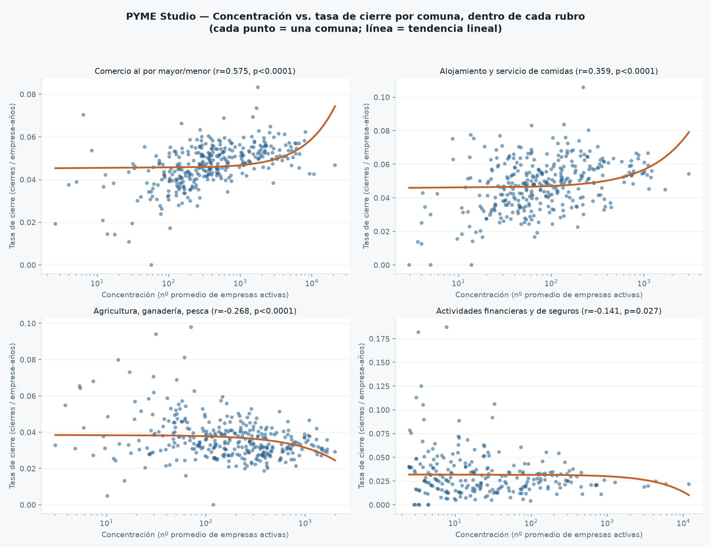
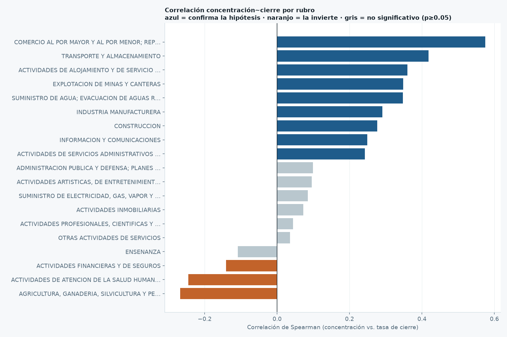
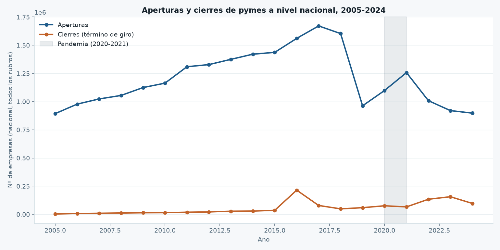
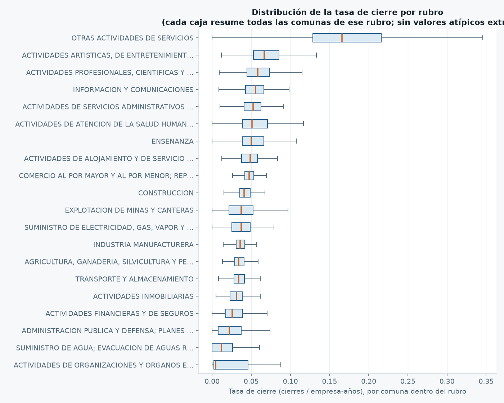
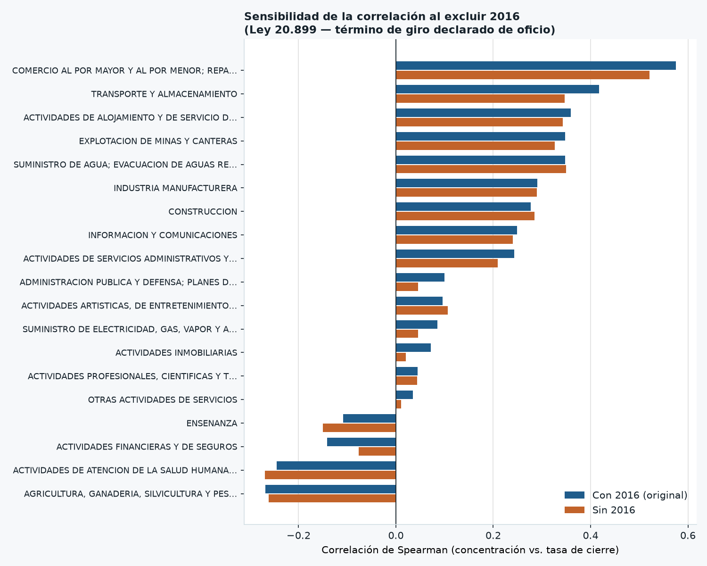

# PYME Studio — Hito 4: Primer análisis completo

*Script: `../../src/analisis_hito4.py` · Datos: `../../outputs/pyme_studio_unificado.csv` (126.566 filas, 2005-2024)*

## Pregunta de investigación
> ¿Cuál es la concentración de pymes por rubro y comuna, y cómo se relaciona con su tasa histórica de término de giro (cierre)?

## Resultado 1 — Mezclando todos los rubros: correlación prácticamente nula

Al comparar concentración (nº de empresas activas) contra tasa de cierre en las 3.932 combinaciones comuna+rubro con suficiente exposición (≥200 empresa-años), **no hay una relación lineal significativa**:

- Pearson r = **−0,028** (p = 0,077)
- Spearman r = **+0,029** (p = 0,066)

Ninguno es estadísticamente significativo al 5%. **Conclusión parcial (incompleta):** si se analiza "a lo bruto", parecería que la hipótesis original de Ignacio (más negocios similares juntos → más cierres) no se sostiene.

## Resultado 2 — La razón: el efecto depende completamente del rubro

Antes de descartar la hipótesis, se segmentó por tipo de negocio. Los casos de "alta concentración + alta tasa de cierre" están dominados por un rubro (**Otras actividades de servicios**), mientras que "alta concentración + baja tasa de cierre" está dominado por otro completamente distinto (**Actividades financieras y de seguros**). Esto sugiere que mezclar todos los rubros **oculta** el efecto real en vez de mostrarlo.

**Se recalculó la correlación comuna-a-comuna, pero *dentro* de cada rubro por separado** (comparando, por ejemplo, solo comunas entre sí dentro de "Comercio", no comercio contra finanzas). Resultado — 19 rubros con suficientes comunas (≥30) y exposición (≥50 empresa-años):

### Rubros donde SÍ se confirma la hipótesis (a más concentración, más cierres)

| Rubro | Comunas comparadas | Correlación (Spearman) | Significancia |
|---|---:|---:|---|
| **Comercio al por mayor y al por menor; reparación de vehículos** | 342 | **r = 0,575** | p < 0,0001 — muy fuerte |
| Transporte y almacenamiento | 338 | r = 0,418 | p < 0,0001 |
| **Actividades de alojamiento y de servicio de comidas** | 344 | r = 0,359 | p < 0,0001 |
| Explotación de minas y canteras | 221 | r = 0,348 | p < 0,0001 |
| Suministro de agua; gestión de desechos | 293 | r = 0,348 | p < 0,0001 |
| Industria manufacturera | 336 | r = 0,291 | p < 0,0001 |
| Construcción | 335 | r = 0,277 | p < 0,0001 |
| Información y comunicaciones | 269 | r = 0,249 | p < 0,0001 |
| Actividades de servicios administrativos y de apoyo | 330 | r = 0,243 | p < 0,0001 |

**Los dos rubros con la correlación más fuerte y significativa — Comercio (r=0,575) y Alojamiento/Comidas (r=0,359) — son exactamente los que motivaron la idea original de Ignacio** (abarrotes, sushi, pizzerías, sándwiches). No es casualidad: en estos sectores, la evidencia respalda directamente la hipótesis de partida.

### Rubros donde NO se confirma (algunos incluso al revés)

| Rubro | Comunas | Correlación | Interpretación |
|---|---:|---:|---|
| Agricultura, ganadería, silvicultura y pesca | 341 | r = −0,268 (p<0,0001) | Más concentración, **menos** cierre — probable efecto de clústers productivos regionales |
| Salud humana y asistencia social | 223 | r = −0,245 (p<0,001) | Igual — zonas con más oferta de salud parecen más estables |
| Actividades financieras y de seguros | 247 | r = −0,141 (p=0,027) | Débil pero también inverso |
| Enseñanza, Inmobiliarias, Profesionales/científicas, Otras actividades de servicios, Artísticas | varios | r cercano a 0, sin significancia | Sin relación clara |

## Interpretación para el producto final

1. **La hipótesis original no es universal, pero es cierta donde más importa.** En comercio minorista y alojamiento/comidas — el corazón del ejemplo de "sushi y pizzerías en la misma calle" — la saturación comercial sí se asocia con mayor cierre, de forma estadísticamente robusta (n grande, p muy bajo).
2. **En sectores con economías de aglomeración (agricultura, salud), pasa lo contrario** — concentrarse ahí parece ser saludable, no riesgoso. Esto es un hallazgo genuino, no un error: distintos rubros tienen dinámicas de mercado distintas.
3. **Recomendación para el dashboard (Hito 5):** no presentar un solo número de "riesgo por concentración" — mostrar el análisis segmentado por rubro, destacando comercio y alojamiento/comidas como los casos donde el indicador es más confiable y accionable.

## Verificación visual (para revisar "con calma", no solo confiar en el número de r)

`../../src/graficar_hito4.py` genera dispersogramas reales — un punto por comuna — para los 2 rubros donde se confirma la hipótesis y los 2 donde se invierte:

**Lectura del gráfico:** hay ruido real (r=0,36-0,58 no es una línea perfecta, es una tendencia con dispersión) pero la pendiente ascendente en Comercio y Alojamiento/Comidas es visible a simple vista, y la pendiente descendente en Agricultura y Financiero también. No es un artefacto del coeficiente — se puede confirmar mirando los puntos.

*Nota técnica: el eje X está en escala logarítmica (para no aplastar las comunas chicas), por eso la línea de tendencia —que es lineal en la escala real— se ve curva en el gráfico.*

## Gráfico 2 — Ranking de correlación por rubro (para explicar de un vistazo)

En vez de leer la tabla de 19 filas, este gráfico ordena todos los rubros de mayor a menor correlación, coloreado por si el resultado es estadísticamente significativo:

**Cómo explicarlo en una presentación:** "las barras azules (arriba) son los rubros donde más negocios del mismo tipo juntos = más cierres; las naranjas (abajo) son donde pasa lo contrario; las grises no muestran ningún patrón confiable." Comercio queda arriba de todo — es el resultado más fuerte de todo el análisis.

## Gráfico 3 — Serie de tiempo nacional (la dimensión que faltaba: el tiempo)

Todos los gráficos anteriores comparan comunas entre sí, pero nunca mostraron cómo cambian aperturas y cierres año a año. Esta serie de tiempo nacional (todos los rubros sumados) lo muestra:

**Hallazgo inesperado y verificado — el salto de 2016:** los cierres pasan de 35.931 (2015) a **214.705 (2016)**, y vuelven a bajar a 78.744 en 2017. No es un error del dataset — se confirmó con los datos crudos (`pipeline.py`) y tiene una explicación real: la **Ley 20.899** (feb. 2016, vigente desde agosto 2016) le dio al SII la facultad de **declarar de oficio el término de giro** de contribuyentes que llevaban tiempo sin operar pero nunca habían avisado formalmente. El salto de 2016 refleja en buena parte un "barrido administrativo" de empresas ya inactivas, no una ola repentina de quiebras ese año específico.

**Por qué importa para el análisis:** el año 2016 debe tratarse con cuidado si en el Hito 5 se hace algún análisis año a año — mezclarlo sin esta explicación podría leerse como una crisis económica que no existió. La pandemia (2020-2021, sombreada en el gráfico), en cambio, muestra un patrón distinto: caída de aperturas, no un pico de cierres — consistente con menos gente animándose a emprender, más que con una ola de cierres masivos.

## Gráfico 4 — Distribución completa de la tasa de cierre por rubro

La correlación dice si concentración y cierre se relacionan, pero no muestra qué tan dispersos son los valores dentro de cada rubro. Este boxplot lo completa:

**Cómo leerlo:** la línea naranja de cada caja es la mediana, la caja cubre el 50% central de las comunas de ese rubro, y las "antenas" el resto (sin contar casos extremos). "Otras actividades de servicios" no solo tiene los cierres más altos en promedio — también es, por lejos, el rubro más disperso/impredecible. Comercio, en cambio, tiene una caja angosta: la tasa de cierre es más consistente entre comunas, lo que hace que su correlación con la concentración (Gráfico 1) sea más confiable como señal.

## Sensibilidad a 2016 — ¿la correlación depende de un solo año atípico?

El Gráfico 3 mostró que 2016 tiene un salto extraordinario de términos de giro (Ley 20.899, barrido administrativo del SII). Antes de dar el hallazgo por cerrado, correspondía preguntarse: **¿la correlación concentración↔cierre existe porque 2016 la infla, o se sostiene sin ese año?**

Se recalculó la correlación de Spearman por rubro dos veces — con los 20 años completos (el resultado original de arriba) y excluyendo 2016 — con la misma metodología (50+ empresa-años de exposición, 30+ comunas). Script: `../../src/analisis_metodologia.py` → `../../outputs/pyme_studio_sensibilidad_2016.csv`, `../../outputs/figures/hito4_sensibilidad_2016.png`.

**Resultado — los 2 hallazgos centrales no dependen de 2016:**

| Rubro | r con 2016 (original) | r sin 2016 | ¿Cambia la conclusión? |
|---|---:|---:|---|
| Comercio al por mayor y al por menor | 0,575 | 0,521 | No — sigue fuerte y significativo |
| Alojamiento y servicio de comidas | 0,359 | 0,343 | No — sigue significativo |

De los 19 rubros analizados, solo **2 cambian de conclusión** al excluir 2016 (Enseñanza y Actividades Financieras y de Seguros — ninguno de los dos es parte del hallazgo central, y ambos ya eran correlaciones débiles). **Interpretación prudente:** 2016 sí añade algo de señal a la mayoría de las correlaciones (es esperable — el barrido administrativo generó cierres masivos y correlacionados con el tamaño de la base de contribuyentes), pero no la crea de la nada. El resultado que sostiene el producto final (Comercio y Alojamiento/Comidas) es robusto a excluir el año atípico. Detalle metodológico completo en `../metodologia/metodologia.md`.

## Concentración absoluta vs. relativa — ¿favorece a las comunas grandes?

"Concentración" en el análisis de arriba es el **promedio absoluto** de empresas activas — lo que favorece naturalmente a comunas grandes (Santiago va a tener más empresas de cualquier rubro solo por ser más poblada, independiente de si ese rubro está realmente "saturado" ahí). Se agregó una medida relativa — `participacion_rubro_comuna = empresas activas del rubro / total de empresas activas de la comuna` — y se repitió la correlación con ella en vez de con el conteo absoluto. Script: `../../src/analisis_metodologia.py` → `../../outputs/pyme_studio_concentracion_absoluta_vs_relativa.csv`.

**Resultado, para los 2 rubros centrales:**

| Rubro | r (concentración absoluta) | r (participación relativa) | ¿Se mantiene? |
|---|---:|---:|---|
| **Comercio al por mayor y al por menor** | 0,575 | 0,322 | ✅ **Sí** — se mantiene positivo y significativo con ambas métricas |
| **Alojamiento y servicio de comidas** | 0,359 | −0,535 | ❌ **No — se invierte** |

**Esto es un matiz real, no un detalle menor:** el hallazgo de Comercio es robusto a este cambio metodológico. El hallazgo de Alojamiento/Comidas **no** — cuando se mide qué tan grande es ese rubro *como proporción del comercio local* (en vez de en términos absolutos), la relación se invierte: las comunas donde alojamiento/comidas es una porción grande de la actividad local (posibles comunas turísticas especializadas) tienden a tener **menos** cierre, no más. Una lectura plausible es que el resultado original (por conteo absoluto) reflejaba en parte que las ciudades grandes concentran mucha actividad y mucha rotación en general, no necesariamente saturación específica de ese rubro. **De aquí en adelante, cualquier afirmación sobre Alojamiento/Comidas en el dashboard o la presentación debe mostrar ambas métricas, no solo la absoluta** — y "concentración" (a secas) no debe llamarse "saturación" sin esta advertencia. Detalle completo en `../metodologia/metodologia.md`.

## Precisión conceptual (léase antes de citar este análisis)

- Esto es una **asociación histórica entre concentración empresarial y términos de giro registrados** — no una medición de "fracaso" ni de quiebra legal, y no demuestra causalidad.
- Un término de giro puede ser administrativo (ej. el barrido de 2016) o voluntario (venta del negocio, cambio de giro, jubilación) — no todo término de giro es un negocio que "fracasó".
- La tasa es agregada por comuna+rubro — **no predice el cierre de una empresa individual**.
- Detalle completo de este y otros límites metodológicos en `../metodologia/metodologia.md`.

## Archivos generados

**Del análisis original (Hito 4, sin modificar):**
- `../../outputs/pyme_studio_agregado_comuna_rubro.csv` — dataset agregado por comuna+rubro (7.064 filas) usado para este análisis.
- `../../outputs/pyme_studio_correlacion_por_rubro.csv` — tabla de correlación por rubro (la que grafica el Gráfico 2).
- `../../outputs/figures/hito4_dispersion_por_rubro.png`, `hito4_barras_correlacion_por_rubro.png`, `hito4_serie_tiempo_nacional.png`, `hito4_boxplot_tasa_cierre_por_rubro.png` — los 4 gráficos de este documento.
- `../../src/analisis_hito4.py` — cálculo completo (correlación global + por rubro).
- `../../src/graficar_hito4.py` — Gráfico 1 (dispersión).
- `../../src/graficar_hito4_extra.py` — Gráficos 2, 3 y 4.

**Del endurecimiento metodológico posterior (ver `../metodologia/metodologia.md`):**
- `../../outputs/pyme_studio_sensibilidad_2016.csv`, `../../outputs/figures/hito4_sensibilidad_2016.png` — comparación con/sin 2016.
- `../../outputs/pyme_studio_agregado_comuna_rubro_enriquecido.csv` (agrega `participacion_promedio`, no reemplaza el original), `../../outputs/pyme_studio_concentracion_absoluta_vs_relativa.csv` — comparación absoluta vs. relativa.
- `../../outputs/pyme_studio_alcance_pyme_por_rubro.csv`, `../../outputs/pyme_studio_alcance_pyme_por_comuna.csv` — % pyme real del universo analizado.
- `../../src/analisis_metodologia.py` (sensibilidad 2016 + concentración relativa), `../../src/analisis_tamano_empresas.py` (alcance pyme).
